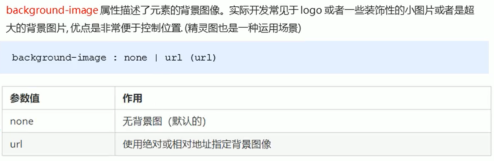

# CSS学习

## CSS基础选择器

### 标签选择器


### 类选择器


使用的时候要用class属性，可以多类选择器一起使用，但是中间要使用空格分开

### id选择器


用id调用，最好不要和其他的id重复

### 通配符选择器


### 基础选择器总结


## CSS字体属性


### 字体属性的连写


## CSS文本属性

### 文本颜色


不过，一般常用16进制，用#后面加颜色的16进制值，还有一种rgb(0，0，0)的写法，这个写法的方便之处在于后面可以再加一个透明度的修改范围在(0,1),可以省略前面的0，比如rgba(255,145,63,.6)

### 对齐文本


默认是靠左对齐

### 装饰文本


### 文本缩进

```css
p {
	text-indent: 20px;
}
/*一般是按照下面这种，不用指定像素缩进*/
p {
	text-indent: 2em;
}
```

文本的首行缩进多少距离

### 行间距

```css
line-height       /*和text-indent用法一致*/
```

### 文本属性总结


## CSS引入方式

### 内部样式表

在html页面里面，一般放在\<head>标签里面，用\<style>\</style>标签包裹起来

### 行内样式表

在内容所在标签里面写上style=""就行

### 外部样式表

新建一个.css的文件，来专门存放css样式，利用以下方式引入

```html
<link rel="stylesheet" href="xxx.css">
```

## Emmet语法

快速生成HTML结构语法


## CSS复合选择器

### 后代选择器


可以一直套娃

### 子代选择器


### 并集选择器


### 伪类选择器

#### 链接伪类选择器


使用顺序就按照上述排列顺序

#### focus伪类选择器


### 复合选择器总结


## CSS的元素显示模式

### 块元素


### 行内元素


### 行内块元素


### CSS的元素显示模式总结


### 元素显示模式的转换

```css
display: block;                        /*转换为块元素*/
display: inline;                       /*转换为行内元素*/
display: inline-block;                 /*转换为行内块元素*/
```

## CSS的背景

### 背景颜色


### 背景图片



### 背景平铺


### 背景图片位置


注意事项


### 背景图像固定


### 背景复合写法


ps：半透明的写法可以参考前面rgba

### 背景总结


## CSS三大特性

### 层叠性


### 继承性


### 优先级

要引入权重的概念，使用复合选择器时，权重进行相加，但是不会进位，比较权重大小与位置来看优先级，也就有可能会是这样的这样的权重（ 1,36,41,36）


!important直接放在属性的值的后面，然后记住，继承的权重为0，如果该元素没有被直接选中，子元素得到的权重始终为0

## CSS盒子模型

### 边框


### 表格的细线边框


边框会影响盒子的实际大小


### 内边距


也会影响盒子的实际大小距离


ps:如果盒子没有直接指定width/height属性，则在进行内边距的大小时，不会撑开盒子的大小。

### 外边距


如果想要盒子水平居中，先设置宽度，然后左右边距写成`auto`的形式


### 外边距合并问题

#### 相邻元素垂直外边距的合并


#### 嵌套块垂直外边距的塌陷元素


## 圆角边框

```css
border-radius: length;         /*设置元素的外边框圆角*/
```


## 盒子阴影


## 文字阴影


